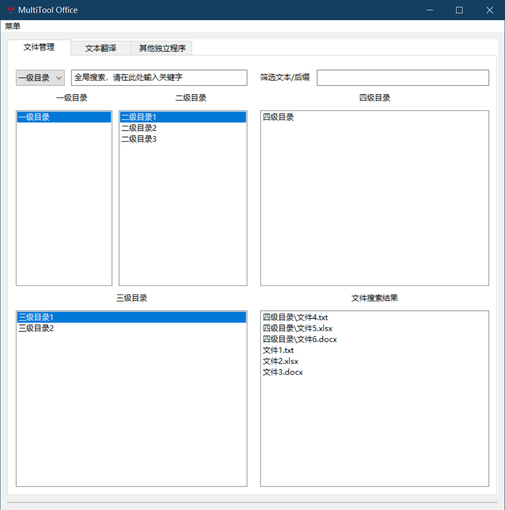

# MultiTool Office

MultiTool Office 是一个基于 wxPython 开发的多功能办公工具，提供文件管理、文本翻译和快捷启动程序等功能。



## 主要功能

### 1. 文件管理
- 支持多级目录浏览和管理
- 文件快速搜索和过滤
- 支持文件和目录的快速访问
- 支持文件路径复制

### 2. 文本翻译
- 支持中文、英文、日文三种语言的互译
- 多行文本翻译
- 翻译结果快捷复制

### 3. 快捷启动
- 可配置28个快捷启动按钮
- 支持自定义按钮名称
- 支持绑定任意可执行文件
- 配置持久化保存

## 技术特性

- 使用 wxPython 构建图形界面
- 多线程处理确保界面响应流畅
- 使用线程池优化文件扫描性能
- LRU缓存优化目录访问
- 配置信息本地持久化

## 环境要求

- Python 3.6+
- wxPython 4.0+
- 其他依赖见 `requirements.txt`

## 安装说明

1. 克隆项目到本地
2. 创建并激活虚拟环境：
   ```bash
   python -m venv venv
   .\venv\Scripts\activate  # Windows
   source venv/bin/activate  # Linux/Mac

3. 安装依赖：
   ```bash
   pip install -r requirements.txt

## 使用说明

1. 直接运行：
   ```bash
   python app.py

2. 打包成可执行文件：
   ```bash
   # 单文件版本
   pyinstaller -F --noconsole app.py -i MultiTool_Office_app\图片1.png

## 项目结构

```
MultiTool_Office_app/
├── GUI.py              # 主界面基类
├── GUI_add.py          # 界面功能扩展类
├── get_files.py        # 文件操作相关功能
├── settings.json       # 配置文件
├── settings.py         # 设置界面
├── translate.py        # 翻译功能
├── constants.py        # 控件ID常量
└── favicon.ico         # 程序图标

app.py                  # 程序入口
requirements.txt        # 项目依赖
```

## 配置说明

- 程序配置保存在 `MultiTool_Office_app/settings.json`
- 按钮配置使用 wxConfig 存储在系统配置中

## 贡献指南

1. Fork 本仓库
2. 创建特性分支
3. 提交更改
4. 发起 Pull Request

