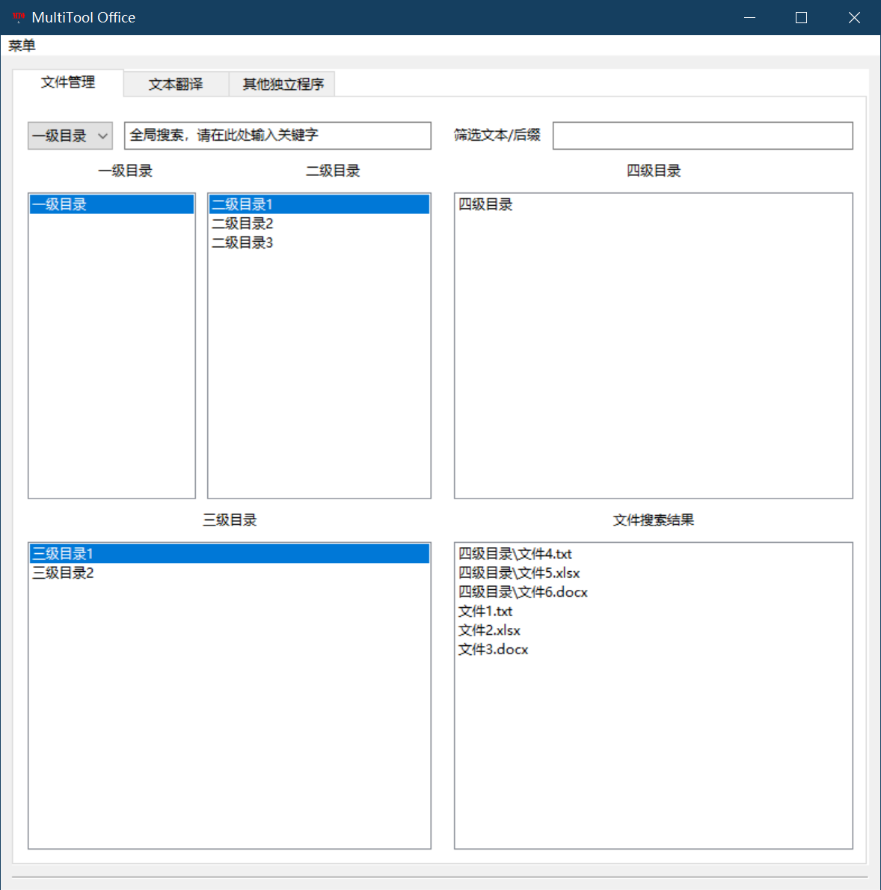

# MultiTool Office

MultiTool Office 是一个基于 wxPython 开发的多功能办公工具，提供文件管理、文本翻译和快捷启动程序等功能。



## ✨ 最新更新 (v2.0)

### 🎨 界面美化
- **现代化主题系统**: 全新的配色方案和视觉设计
- **图标优化**: 使用emoji图标，提升视觉体验
- **动画效果**: 按钮高亮、淡入等流畅动画
- **响应式布局**: 更好的控件排列和间距

### ⚡ 性能优化
- **异步文件扫描**: 大幅提升大目录浏览速度
- **智能缓存系统**: LRU缓存机制，减少重复计算
- **防抖搜索**: 避免频繁搜索，提升响应速度
- **线程池优化**: 更高效的多线程处理

### 🔧 功能增强
- **分页加载**: 大量文件分批次加载，避免界面卡顿
- **搜索优化**: 支持实时搜索和文件类型过滤
- **翻译增强**: 改进的翻译API，支持缓存和重试
- **程序管理**: 增强的独立程序管理器，支持日志记录

## 主要功能

### 📁 文件管理
- 多级目录浏览（支持4级目录结构）
- 实时文件搜索和过滤
- 文件类型图标显示
- 快速目录切换
- 文件路径复制

### 🌐 文本翻译
- 支持中英日三种语言互译
- 智能翻译缓存
- 一键复制翻译结果
- 批量文本处理

### 🚀 程序管理
- 自定义程序快捷启动
- 可视化程序绑定
- 按钮重命名功能
- 操作日志记录
- 悬停效果和动画反馈

## 技术特性

- 使用 wxPython 构建现代化图形界面
- 多线程处理确保界面响应流畅
- 使用线程池优化文件扫描性能
- LRU缓存优化目录访问和翻译结果
- 配置信息本地持久化
- 防抖和节流机制提升用户体验
- 智能内存管理和垃圾回收

## 性能特性

### 🔄 缓存系统
- **目录缓存**: 5分钟过期时间，避免重复扫描
- **翻译缓存**: LRU缓存机制，提升翻译速度
- **智能清理**: 自动清理过期缓存，节省内存

### ⚡ 异步处理
- **文件扫描**: 后台异步扫描，不阻塞界面
- **目录加载**: 分批次加载，提升响应速度
- **翻译处理**: 异步翻译请求，支持并发

### 🎯 用户体验
- **防抖搜索**: 0.5秒防抖，减少无效请求
- **分页显示**: 大量文件分页加载
- **进度反馈**: 实时操作状态提示

## 环境要求

- Python 3.7+
- wxPython 4.0+
- requests (用于翻译功能)
- 其他依赖见 `requirements.txt`

## 安装说明

1. 克隆项目到本地：
   ```bash
   git clone https://github.com/d8349565/MultiTool_Office.git
   cd MultiTool_Office
   ```

2. 创建并激活虚拟环境：
   ```bash
   python -m venv venv
   .\\venv\\Scripts\\activate  # Windows
   source venv/bin/activate    # Linux/Mac
   ```

3. 安装依赖：
   ```bash
   pip install -r requirements.txt
   ```

## 使用说明

1. 直接运行：
   ```bash
   python app.py
   ```

2. 打包成可执行文件：
   ```bash
   # 单文件版本
   pyinstaller -F --noconsole app.py -i MultiTool_Office_app\\图片1.png
   ```

## 项目结构

```
MultiTool_Office_app/
├── GUI.py              # 主界面基类 (优化版)
├── GUI_add.py          # 界面功能扩展类 (优化版)
├── get_files.py        # 文件操作相关功能 (性能优化)
├── translate.py        # 翻译功能 (连接池优化)
├── theme.py            # 现代化主题系统 (新增)
├── performance.py      # 性能优化模块 (新增)
├── settings.json       # 配置文件
├── settings.py         # 设置界面
├── constants.py        # 控件ID常量
└── favicon.ico         # 程序图标

app.py                  # 程序入口
requirements.txt        # 项目依赖
```

## 配置说明

- 程序配置保存在 `MultiTool_Office_app/settings.json`
- 按钮配置使用 wxConfig 存储在系统配置中
- 支持自动备份和配置恢复
- 新增主题配置和性能参数

## 版本历史

### v2.0 (最新)
- 🎨 全新现代化UI设计
- ⚡ 大幅性能优化
- 🔧 增强功能体验
- 📊 添加性能监控

### v1.0
- 基础文件管理功能
- 简单翻译功能
- 程序快捷启动
requirements.txt        # 项目依赖
```

## 贡献指南

1. Fork 本仓库
2. 创建特性分支 (`git checkout -b feature/AmazingFeature`)
3. 提交更改 (`git commit -m 'Add some AmazingFeature'`)
4. 推送到分支 (`git push origin feature/AmazingFeature`)
5. 发起 Pull Request

## 许可证

本项目采用 MIT 许可证 - 详见 [LICENSE](LICENSE) 文件

## 致谢

感谢所有贡献者的努力和支持！

---

**享受更高效的办公体验！** 🚀

